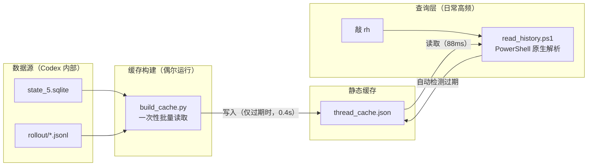

> 🏷️ **标签**：性能优化 · PowerShell · Python · Codex · DeepSeek · 工具开发
> 📦 **GitHub**：[larcher-m/codex-thread-cache](https://github.com/larcher-m/codex-thread-cache)

# Codex + DeepSeek 用户请进：你的对话记录是不是也卡到想砸键盘？

## TL;DR

Codex CLI 接入 DeepSeek 后，查看历史对话每次要等 **6 秒**。排查发现不是数据量大（仅 11 个线程、4.5MB），而是每次查询都冷启动 Python 解释器。最终方案：用 Python 一次性预建 JSON 缓存，日常查询改用 PowerShell 原生解析——**从 6000ms 降到 88ms，提升 68 倍**。两个文件、一行别名配置，即可彻底解决。

---

## 起因

最近把 Codex CLI 的默认模型从 GPT 换成了 DeepSeek，用着挺爽——直到我发现一个致命问题：

**每次切对话记录都要等 6 秒。**

不是什么偶发卡顿，是每一次。翻 5 个历史对话就要干坐半分钟。作为一个一天切几十次对话的人，这简直没法用。

## 第一反应：数据库太大了？

Codex 的对话数据存在两个地方：

- `~/.codex/state_5.sqlite` — 存线程元数据（标题、时间、模型等）
- `~/.codex/sessions/2026/05/*.jsonl` — 存完整对话内容（每条消息一行 JSON）

我心想肯定是数据太多了。一扫：

```
11 个线程
4.5 MB JSONL 数据
```

就这？4.5MB 要 6 秒？不可能是数据量的问题。

## 真正的原因：Python 冷启动

Codex 内部查询对话用的是 `python -c` 内联脚本，大概长这样：

```bash
python -c "import sqlite3; import json; db=sqlite3.connect(...); ..."
```

每一次执行，系统都要走完这一整套流程：

```
启动 Python 解释器      ████████████ ~2000ms
加载 sqlite3 模块       ███           ~500ms
连接数据库 + SQL 查询    ███           ~500ms
逐行读取并解析 JSONL     ██████        ~1000ms
格式化输出              ███           ~500ms
进程退出                ██            ~500ms
────────────────────────────────────────────
总计                                  ~5000-7000ms
```

Python 启动本身就占了 2 秒。11 个线程，11 次查询，每次都从零开始。

**根因不是数据多，而是每次都在重复启动一个重量级运行时。**

## 第一版方案：预建缓存

思路很直接——既然每次都要读 SQLite 和 JSONL，那就一次性全读完，写成一个大 JSON 文件当缓存，以后只读这个 JSON 就完了。

`build_cache.py`：

```python
import sqlite3, json, os
from datetime import datetime, timezone, timedelta

DB = os.path.expanduser("~/.codex/state_5.sqlite")
CACHE = os.path.expanduser("~/.codex/thread_cache.json")

# 一次性读 SQLite
db = sqlite3.connect(DB)
db.row_factory = sqlite3.Row
rows = db.execute("SELECT * FROM threads ORDER BY created_at DESC").fetchall()

# 逐线程读 JSONL
threads = {}
for r in rows:
    messages = []
    if r["rollout_path"] and os.path.exists(r["rollout_path"]):
        with open(r["rollout_path"], encoding="utf-8") as f:
            for line in f:
                if line.strip():
                    msg = json.loads(line)
                    messages.append({
                        "role": msg.get("role", "?"),
                        "content": extract_content(msg)
                    })
    threads[r["id"]] = {
        "title": r["title"], "model": r["model"],
        "msg_count": len(messages), "messages": messages
    }

with open(CACHE, "w", encoding="utf-8") as f:
    json.dump({"count": len(threads), "threads": threads}, f)
```

跑一下：

```
Cache built: 11 threads, 2515 total messages
Time: 0.4s   ← 一次性建完
```

然后写个 `read_history.py` 读缓存、加个 PowerShell 别名 `rh`。效果不错：

```
从 6 秒 → 0.4 秒，提升 15 倍
```

我挺满意。但第二天打开电脑，敲 `rh`——又是 3 秒。

## 问题没完：重启后 Python 冷启动照旧

3 秒不是读取慢，是 **Python 启动本身就要 2～3 秒**。缓存文件在那躺着，但要读到它，还是得先启动 Python。

这让我意识到一个关键问题：**缓存思路没错，但用 Python 做高频轻量读取本身就是错的。**

## 终局方案：两层架构



**核心洞察**：把工作分成两层——

| 层级 | 做什么 | 用什么 | 启动开销 | 频率 |
|---|---|---|---|---|
| 构建层 | SQLite + JSONL → JSON 缓存 | Python | 接受（一次性） | 偶尔（缓存过期时） |
| 查询层 | 读 JSON → 终端输出 | PowerShell | **零** | 高频（每次敲 `rh`） |

PowerShell 是 Windows 终端自带的，`Get-Content | ConvertFrom-Json` 没有进程启动开销，88ms 出结果。

**自动过期检测**是实现"无感"的关键：

```powershell
$cacheTime = (Get-Item $CACHE).LastWriteTime
$dbTime = (Get-Item $DB).LastWriteTime
if ($dbTime -gt $cacheTime) {
    Write-Host "(rebuilding cache...)" 
    python build_cache.py   # 数据库更新了，自动重建
}
```

如果数据库没变，纯 PowerShell 秒读；如果变了（比如新建了对话），自动触发一次 Python 重建——用户完全不用操心。

### 性能对比

```mermaid
---
title: 三阶段性能对比
---
gantt
    title 单次查询耗时（毫秒）
    dateFormat X
    axisFormat %s ms

    section 优化前
    Python 冷启动       :0, 2000
    sqlite3 + JSONL解析 :2000, 5000
    输出                :5000, 6000

    section 第一版
    Python 冷启动       :0, 2000
    读 JSON 缓存        :2000, 2900
    输出                :2900, 3300

    section 终版
    读 JSON 缓存        :0, 50
    格式化输出          :50, 88
```



| 场景 | 优化前 | 第一版 | 终版 | 总提升 |
|---|---|---|---|---|
| 列出对话列表 | ~6000ms | ~3000ms | **88ms** | **68×** |
| 查看指定对话 | ~6000ms | ~3000ms | **135ms** | **44×** |
| 缓存重建 | 6s × N 次 | 手动触发 | 0.4s（自动） | — |

## 代码仓库

完整代码见 GitHub：[larcher-m/codex-thread-cache](https://github.com/larcher-m/codex-thread-cache)

### 快速开始

```powershell
# 1. 克隆仓库
git clone https://github.com/larcher-m/codex-thread-cache.git

# 2. 构建缓存（初次使用，后续自动）
python build_cache.py

# 3. 添加别名到 PowerShell Profile
Add-Content $PROFILE "`nfunction Read-History { & 'path\to\read_history.ps1' @args }`nSet-Alias rh Read-History"

# 4. 使用
rh              # 列出所有对话
rh 019e64be     # 查看指定对话
rh --rebuild    # 强制刷新缓存
```

## 思路总结

这个方案的精髓不是「写了更好的 SQL」，而是做了一个关键的**运行时选择**：

> 把一次性重活交给 Python（批量构建），把高频轻活交给原生 Shell（秒级读取）。

三条原则可以带到任何类似场景：

1. **预计算 > 实时查询** — 能提前算完的就别每次现场算
2. **用对的工具做对的事** — Python 是好锤子，但不是每个问题都是钉子
3. **让过期检测自动化** — 用户只需要敲一个命令，不该操心缓存新不新鲜

---

*如果你也遇到类似的「明明数据不多但就是慢」的问题，先别急着优化查询——看看是不是每次都在冷启动一个重量级运行时。这个坑比数据量本身更常见。*

*欢迎在掘金评论区交流，或在 GitHub 提 Issue / PR。*
